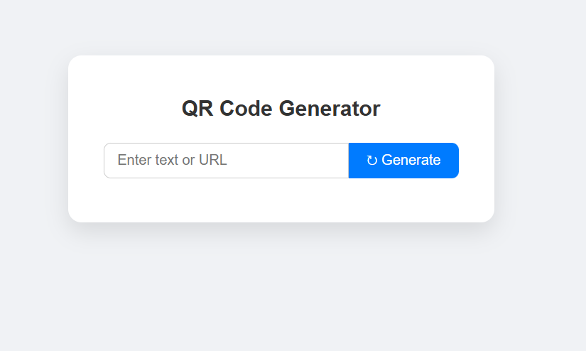

# 📄 QR Code Generator (Django)

A simple and clean web application built using **Django** that allows users to generate QR codes from text or URLs instantly.

---

## 🚀 Features

- Generate QR codes from text or URLs  
- Instant preview of generated QR code  
- Clean and simple user interface  
- Built using Django framework  
- Uses SQLite database  
- Runs inside a virtual environment  

---

## 🛠️ Technologies Used

- Python  
- Django  
- qrcode library  
- Pillow  
- HTML & CSS  
- SQLite  

---

## ⚙️ Installation & Setup

### 1️⃣ Clone the Repository

```bash
git clone https://github.com/your-username/qr-code-generator.git
cd qr-code-generator
```

---

### 2️⃣ Create Virtual Environment

```bash
python -m venv venv
```

---

### 3️⃣ Activate Virtual Environment

On Windows:

```bash
venv\Scripts\activate
```

On Mac/Linux:

```bash
source venv/bin/activate
```

---

### 4️⃣ Install Required Dependencies

```bash
pip install django qrcode pillow
```

---

### 5️⃣ Apply Migrations

```bash
python manage.py migrate
```

---

### 6️⃣ Run the Application

```bash
python manage.py runserver
```

Open your browser and visit:

👉 http://127.0.0.1:8000/

---

## 📂 Project Structure

```text
QRPROJECT
 ┣ generator
 ┃ ┣ views.py
 ┃ ┣ urls.py
 ┃ ┗ templates/
 ┃    ┗ generator/
 ┃       ┗ index.html
 ┣ qrcode_project
 ┃ ┣ settings.py
 ┃ ┣ urls.py
 ┃ ┣ wsgi.py
 ┃ ┗ asgi.py
 ┣ manage.py
 ┣ db.sqlite3
 ┣ README.md
 ┣ images/
 ┗ venv
```

---

## 📌 How It Works

1. User enters text or URL.
2. The form sends a POST request to the Django view.
3. The `qrcode` library generates a QR image.
4. The QR code is saved inside the `media` folder.
5. The generated QR code is displayed on the webpage.

---

## 🖼️ Screenshots

### 🔹 Home Page

<p align="center">
  
</p>

### 🔹 Generated QR Code

<p align="center">
  
</p>

---

## 🎯 Learning Outcomes

- Understanding Django project structure  
- Handling POST requests  
- Working with external Python libraries  
- Dynamic template rendering  
- Managing virtual environments  

---

## 👩‍💻 Developed By

**K. G. Dhanyasree**  
Aspiring Software Developer  

🔗 GitHub: https://github.com/DHANYASREE-KG  
🔗 LinkedIn: https://www.linkedin.com/in/dhanya-sree-k-g  

---

## 🛡️ License

This project is created for learning and portfolio purposes.

---

🚀 Happy Coding!
